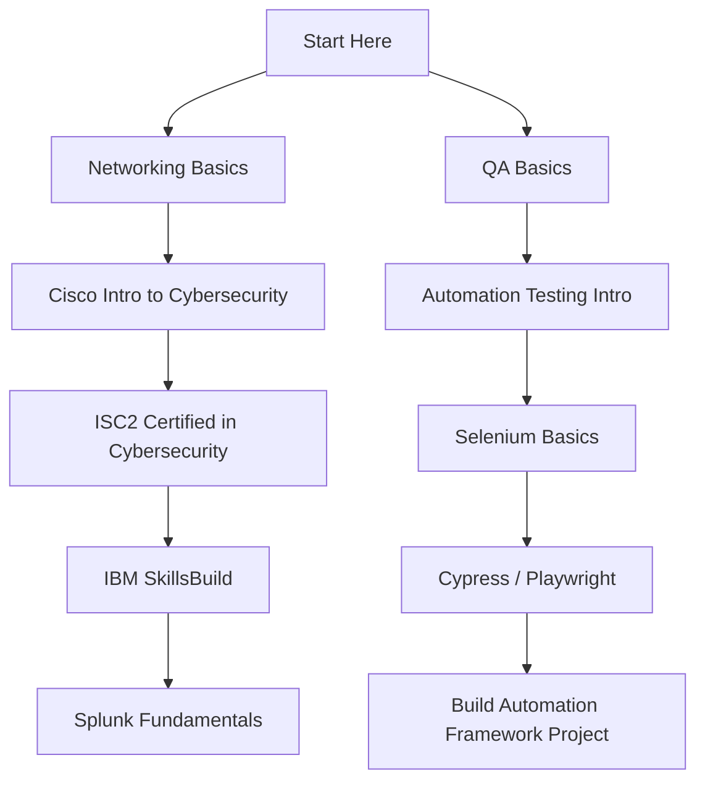

<!-- ========================================================= -->
<!-- ===================== PROJECT BANNER ==================== -->
<!-- ========================================================= -->

<p align="center">
  
</p>

<p align="center">
  
  
  
  
</p>

---

# 🛡️ Free Cybersecurity & Automation Testing Certifications

A curated and verified list of **genuinely free certifications and certificate-based courses** for:

- 🔐 Cybersecurity
- 🤖 Automation Testing

Designed for:
- Students
- Self-learners
- Career switchers
- Entry-level IT aspirants
- QA Engineers
- SOC Analyst aspirants

---

# 📌 Table of Contents

- [Cybersecurity Certifications](#-cybersecurity-certifications-free)
- [Automation Testing Certifications](#-automation-testing-certifications-free)
- [Learning Roadmap](#-learning-roadmap)
- [How This Helps Your Resume](#-how-this-helps-your-resume)
- [Repository Structure](#-repository-structure)
- [Contribution](#-contribution)

---

# 🔐 Cybersecurity Certifications (Free)

| Certification | Provider | Level | Certificate | Official Link |
|--------------|----------|--------|------------|---------------|
| Certified in Cybersecurity (CC) | ISC2 | Beginner | ✅ Yes | https://www.isc2.org/Certifications/CC |
| Introduction to Cybersecurity | Cisco Networking Academy | Beginner | ✅ Badge | https://www.netacad.com/courses/cybersecurity/introduction-cybersecurity |
| Cybersecurity Essentials | Cisco Networking Academy | Beginner | ✅ Badge | https://www.netacad.com/courses/cybersecurity/cybersecurity-essentials |
| Cybersecurity Analyst | IBM SkillsBuild | Beginner | ✅ Yes | https://skillsbuild.org/students/course-catalog/cybersecurity |
| Splunk Fundamentals 1 | Splunk | Beginner | ✅ Yes | https://www.splunk.com/en_us/training/free-courses/splunk-fundamentals-1.html |
| Google Cybersecurity Certificate | Google via Coursera | Beginner | ⚠ Audit Free | https://www.coursera.org/professional-certificates/google-cybersecurity |
| Free Learning Paths | TryHackMe | Beginner | ⚠ Limited | https://tryhackme.com |
| Free Security Courses | Cybrary | Beginner | ⚠ Some Free | https://www.cybrary.it |
| Software & Security Certification | Sanfoundry | Beginner | ✅ Yes | https://www.sanfoundry.com |

---

# 🤖 Automation Testing Certifications (Free)

| Certification | Provider | Level | Certificate | Official Link |
|--------------|----------|--------|------------|---------------|
| Selenium Basics | Great Learning | Beginner | ✅ Yes | https://www.mygreatlearning.com/academy/learn-for-free/courses/selenium-basics |
| Introduction to Automation Testing | Great Learning | Beginner | ✅ Yes | https://www.mygreatlearning.com/academy/learn-for-free/courses/introduction-to-automation-testing |
| Selenium 101 | LambdaTest TestMu | Beginner | ✅ Yes | https://www.testmu.ai |
| Cypress 101 | LambdaTest TestMu | Beginner | ✅ Yes | https://www.testmu.ai |
| Playwright Certification | LambdaTest TestMu | Beginner | ✅ Yes | https://www.testmu.ai |
| Software Testing Certification | Sanfoundry | Beginner | ✅ Yes | https://www.sanfoundry.com/certification/software-testing-certification |
| Test Automation Foundations | LinkedIn Learning | Beginner | ⚠ Limited Free | https://www.linkedin.com/learning |

---

# 📊 Learning Roadmap



---

# 🏆 How This Helps Your Resume

## 🔐 Cybersecurity Roles
- SOC Analyst (Tier 1)
- Junior Security Analyst
- IT Support with Security Focus
- Blue Team Intern

## 🤖 Automation / QA Roles
- QA Engineer (Fresher)
- Automation Test Engineer
- SDET (Entry-Level)
- Manual + Automation Tester

---

# 📂 Repository Structure

Recommended project structure:

```
free-certifications/
│
├── README.md
├── assets/
│   ├── banner.png
│   └── roadmap.png
│
├── cybersecurity/
│   ├── beginner.md
│   ├── intermediate.md
│   └── resources.md
│
├── automation-testing/
│   ├── selenium.md
│   ├── cypress.md
│   ├── playwright.md
│   └── resources.md
│
├── resume-examples/
│   ├── cybersecurity-resume-template.md
│   └── qa-resume-template.md
│
└── contribution-guide.md
```

---

# 🚀 Best Way to Use This Repo

1. Complete at least 3 certifications.
2. Upload certificates to LinkedIn.
3. Add projects related to the certification.
4. Mention tools used (SIEM, Selenium, Cypress, etc.)
5. Showcase GitHub automation projects.

---

# 🤝 Contribution

Want to add:
- A new free certification?
- Limited-time free exam vouchers?
- Expired link updates?

Open an Issue or Pull Request.

---

# ⭐ Support

If this repository helps you, consider giving it a ⭐  
It motivates continuous updates and improvements.

<p align="center">
  
</p>
